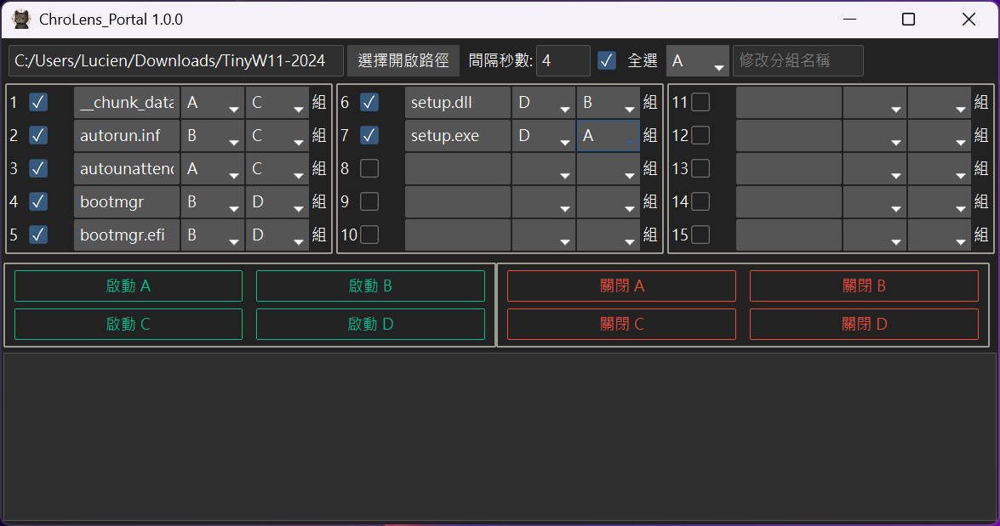

# ChroLens_Portal
## 未來計劃
* 可能加入定時自動開啟程式並啟動/關閉分組。
---

[English](README_EN.md) | [日本語](README_JA.md)

---

### ChroLens_Portal 核心功能：讓你的電腦也變「懶人包」啟動器！

這程式像**電腦啟動幫手**，適合現在常常需要同時開一堆東西的狀況。
忙，還要更忙

它可以：

* **「一鍵啟動」：** 把常用的程式、文件或捷徑分組，按一下就能全部依序打開，不用一個一個點。
* **「用完即關」：** 搞定了一組任務，也能輕鬆把相關視窗一次關掉，讓桌面乾淨溜溜。
* **「自動記憶」：** 不管是你的分組名稱、檔案清單還是開啟順序，下次打開程式都幫你記好好。

### 「分組啟動」：為你的效率量身打造的專屬「情境模式」

這個程式最貼心的設計，就是能讓你將電腦裡各式各樣的檔案和應用程式，**依據不同需求「打包」成各具特色的「情境模式」**。不論是文件、圖片、影片、音樂，甚至是各種捷徑（`.LNK` 檔），都能妥善管理。想像一下，這就像是為你的數位生活量身打造的智能快捷鍵：

**寫專案時**：Word + 參考文件 PDF + 瀏覽器
**設計時**：Photoshop + Illustrator + 素材資料夾
**玩遊戲時**：模擬器/楓之谷Artale/LOL + Discord + 攻略網站

---

### 📄 授權資訊 (Licensing)

本專案的程式碼依循 **GNU General Public License v3.0 (GPLv3)** 發布。這表示你可以自由地使用、學習、修改及分發本程式碼，但請務必遵守該許可證的所有條款。

**如果你希望將本程式碼用於閉源專案、商業販售，或需要專門的商業支援服務，請聯繫。**

詳情請參閱專案根目錄下的 [LICENSE 檔案](LICENSE)。
---
### 📄 免責聲明
此程式碼僅供一般參考及用途。作者不對因使用或無法使用此程式碼所造成的任何損害承擔責任。使用本程式碼的風險由使用者自行承擔。
---

### 💸 支持作者 / Support the Creator / 作者を応援する

🧠 **這些程式幫你省下的時間，分一點來抖內吧！給我錢！**  
⌛ **These scripts saved you time—share a bit and donate. Give me money!**  
🪙 **このツールで浮いた時間、ちょっとだけ投げ銭して？お金ちょうだい！**

👉

👉當然，如果你有任何問題、想法或建議，請加入我的 [Discord－ChroLens_](https://discord.gg/72Kbs4WPPn)

