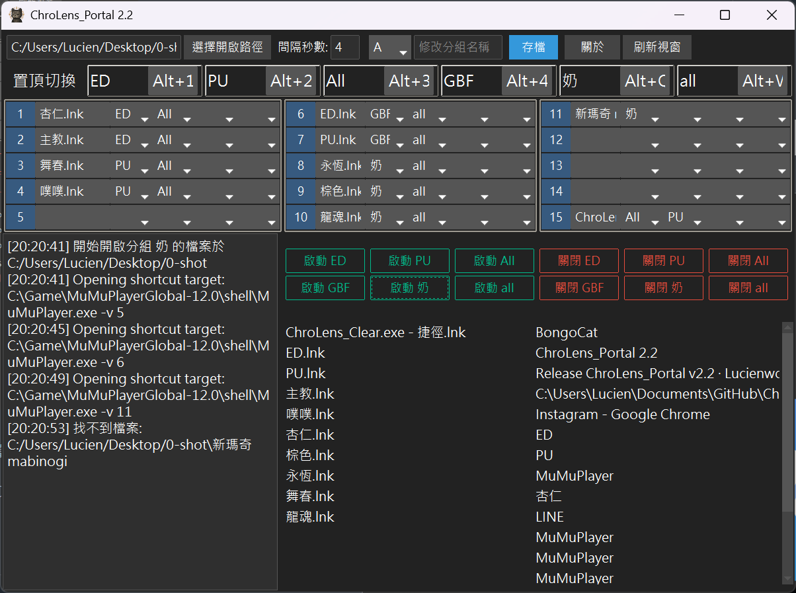

# ChroLens_Portal 2.4

> 視窗管理工具 - 分組啟動、快捷切換、智能布局記憶、自動更新


[[ChroLens_Portal_基本操作]](https://player.vimeo.com/video/1087659485?h=83487a7ea9)

---

## 🌏 多語言介紹

### 🇹🇼 繁體中文
**ChroLens_Portal** 是一款 Windows 視窗管理工具，讓你輕鬆管理多個程式分組。  
就像遊戲玩家常用的 **DisplayFusion** 或 **PowerToys FancyZones**，但更專注於分組啟動和快捷切換。  
無需複雜設定，一鍵啟動工作環境，快捷鍵瞬間切換，讓多工作業更流暢！

---

### 🇯🇵 日本語の紹介

**ChroLens_Portal** は、Windows上で複数のアプリケーションを**グループごとに管理・起動**できるウィンドウ管理ツールです。  
**DisplayFusion** や **PowerToys FancyZones** のような強力なウィンドウ配置ツールに触発されつつ、より**シンプルなグループ起動とホットキー切替**に特化しています。

日本のユーザーに人気の **ClocX**（デスクトップカスタマイズ）や **窓の手**（Windowsカスタマイズ）のように、作業効率を高めるための便利ツールとして活用できます。  
複雑な設定は不要で、ワンクリックで作業環境を起動し、ホットキーで瞬時に切り替えられます。

**主な機能：**
- グループ起動（ファイル・アプリを一括起動）
- ホットキー切替（Alt+1/2/3/Q/W/E で即座に切り替え）
- レイアウト記憶（PowerToys FancyZones風の配置保存）
- スケジュール起動（指定時刻に自動起動）
- 自動更新システム

**こんな場面で便利：**
- 複数のプロジェクトを切り替える開発者
- ゲーム配信で複数ツールを管理する配信者
- 複数のブラウザタブやアプリを同時管理したいパワーユーザー

---

### 🇺🇸 English Introduction

**ChroLens_Portal** is a Windows window management tool that helps you organize and launch multiple applications in groups.  
Inspired by powerful tools like **DisplayFusion** and **PowerToys FancyZones**, ChroLens_Portal focuses on **simplified group launching and hotkey switching** for everyday productivity.

Think of it as a blend of **Launchy** (quick app launcher) and **AquaSnap** (window management), but designed specifically for managing application groups rather than just individual windows.

**Key Features:**
- Group Launch (launch multiple files/apps with one click)
- Hotkey Switching (Alt+1/2/3/Q/W/E for instant switching)
- Layout Memory (FancyZones-style window positioning)
- Scheduled Launch (auto-start groups at specific times)
- Auto-Update System

**Perfect for:**
- Developers switching between multiple projects
- Streamers managing obs, chat tools, and games simultaneously
- Power users juggling multiple browser tabs and applications
- Anyone tired of manually opening the same apps every day

Similar to how **Microsoft PowerToys** enhances Windows productivity, ChroLens_Portal streamlines your workflow by turning repetitive window management into single-key operations.

---

## ✨ 核心功能

### 🚀 分組啟動
將常用的程式、文件或捷徑分組，一鍵啟動所有應用，支援 `.lnk` 捷徑檔案。

### 🔄 快捷切換  
預設熱鍵 `Alt+1/2/3/Q/W/E` 快速切換分組視窗，自動置頂並恢復布局。

### 🎯 視窗管理
一鍵關閉分組視窗，批量管理讓桌面保持整潔。

### 💾 智能布局記憶 ⭐ NEW
- **一鍵記憶**：按「存檔」捕獲所有分組視窗的位置、大小、狀態
- **自動恢復**：啟動分組或使用快捷鍵時自動還原布局
- **多螢幕支援**：完整支援多顯示器配置
- **狀態保存**：記住視窗的正常/最大化/最小化狀態

### ⏰ 排程功能
- 設定時間自動啟動指定分組
- 支援啟用/停用排程
- 整合 Windows 工作排程器

### 🔐 管理員權限
自動請求管理員權限，確保所有視窗操作正常運作。

### 🔄 自動更新系統 ⭐ NEW (v2.4)
- **一鍵檢查更新**：從 GitHub Releases 自動檢查最新版本
- **自動下載安裝**：支援自動下載更新包並安裝
- **進度顯示**：下載和安裝過程即時顯示進度
- **安全備份**：自動備份舊版本資訊

---

## 📦 快速開始

### 1. 安裝依賴
```bash
pip install -r requirements.txt
```

必要套件：
- `ttkbootstrap` - 現代化 UI 框架
- `pywin32` - Windows API 支援
- `keyboard` - 全域快捷鍵

### 2. 啟動程式
```bash
python ChroLens_Portal2.3.py
```

⚠️ **重要**：程式需要管理員權限才能完整運作，首次啟動會自動請求 UAC 提升。

### 3. 打包成 EXE（可選）
```bash
pyinstaller --onefile --noconsole --uac-admin ^
  --add-data "冥想貓貓.ico;." ^
  --icon=冥想貓貓.ico ^
  --hidden-import=win32timezone ^
  ChroLens_Portal2.3.py
```

---

## 🎮 使用場景

### 💼 開發模式
- **分組 A**: VSCode + Chrome DevTools + Terminal  
  → 儲存布局：左側編輯器 (主螢幕 1920x1080)、右側瀏覽器 (副螢幕)、底部終端
  → 快捷鍵 `Alt+1` 一鍵切換到開發環境

### 🎨 設計模式  
- **分組 B**: Photoshop + Illustrator + 參考圖片  
  → 儲存布局：主螢幕全螢幕 PS、副螢幕工具面板、參考資料
  → 快捷鍵 `Alt+2` 切換到設計環境

### 📚 學習/寫作模式
- **分組 C**: Word + PDF閱讀器 + 瀏覽器  
  → 儲存布局：左側筆記 (800x1000)、中間教材 (1000x1000)、右側搜尋
  → 快捷鍵 `Alt+3` 快速進入學習狀態

### 🎮 遊戲/娛樂模式
- **分組 D**: 遊戲 + Discord + 攻略網站  
  → 儲存布局：全螢幕遊戲、右上 Discord (小視窗)、副螢幕攻略
  → 快捷鍵 `Alt+Q` 切換娛樂模式

---

## 🔧 使用方式

### 基本操作
1. **選擇資料夾** - 點擊「選擇開啟路徑」設定檔案來源
2. **新增檔案** - 從清單拖曳檔案或視窗標題到分組欄位  
3. **選擇分組** - 每個檔案可選擇 A~F 任一分組（可多選）
4. **啟動分組** - 點擊「啟動 X」按鈕或使用熱鍵
5. **關閉分組** - 點擊「關閉 X」按鈕

### 布局記憶功能 🆕
1. **記憶布局**
   - 啟動分組並調整所有視窗到理想位置
   - 點擊頂部「**存檔**」按鈕
   - 程式會捕獲所有視窗的位置、大小、狀態

2. **恢復布局**
   - **方法 1**：啟動分組時自動恢復
   - **方法 2**：使用快捷鍵 (`Alt+1~3/Q/W/E`) 立即恢復並置頂

3. **快捷鍵說明**
   - `Alt+1` → 置頂分組 A 並恢復布局
   - `Alt+2` → 置頂分組 B 並恢復布局
   - `Alt+3` → 置頂分組 C 並恢復布局
   - `Alt+Q` → 置頂分組 D 並恢復布局
   - `Alt+W` → 置頂分組 E 並恢復布局
   - `Alt+E` → 置頂分組 F 並恢復布局

### 排程功能 🆕
1. 點擊「排程」按鈕開啟排程設定
2. 選擇分組和時間（24 小時制下拉選單）
3. 點擊「新增」建立排程
4. 使用開關控制啟用/停用
5. 點擊「刪除」移除不需要的排程

---

## 📁 專案結構

```
ChroLens_Portal/
├── ChroLens_Portal2.3.py    # 主程式（整合版）
├── chrolens_portal.json     # 設定檔（自動生成）
├── requirements.txt         # Python 依賴套件
├── README.md               # 說明文件
└── LICENSE                 # 授權資訊
```

### 核心模組說明
- **視窗管理**：使用 win32gui API 進行視窗操作
- **布局記憶**：捕獲並恢復視窗位置、大小、狀態
- **快捷鍵系統**：keyboard 庫實現全域熱鍵
- **排程功能**：整合 Windows Task Scheduler
- **UI 框架**：ttkbootstrap (美化版 tkinter)

---

## ⚙️ 設定檔

程式會自動創建並管理以下設定檔：

- `chrolens_portal.json` - 主要設定
  - 檔案路徑、間隔秒數
  - 分組名稱、快捷鍵配置
  - 檔案與分組對應關係
  - 排程任務列表
  - **視窗布局資料** (window_layouts)

設定檔格式範例：
```json
{
  "folder": "C:\\Users\\YourName\\Documents\\Apps",
  "interval": "4",
  "group_display_names": {
    "A": "開發環境",
    "B": "設計工具",
    "C": "文書處理"
  },
  "window_layouts": {
    "A": {
      "vscode.exe": {
        "x": 0,
        "y": 0,
        "width": 1920,
        "height": 1080,
        "state": 1
      }
    }
  },
  "schedule_tasks": [
    {
      "group": "A",
      "time": "09:00",
      "enabled": true
    }
  ]
}
```

---

## 📝 更新日誌

> 📋 **完整版本記錄請查看** [UPDATE.md](UPDATE.md)

### v2.4 (2025/11/19) - 最新版本
- ✨ **自動更新系統**
  - 整合 GitHub Releases 自動更新機制
  - 支援一鍵檢查更新與自動安裝
  - 即時顯示下載和安裝進度
- 📦 **開發工具**
  - 新增 `build_simple.py` 和 `打包.bat`
  - 優化專案結構，移除冗餘文件
- 🔧 **版本號統一管理**
  - 視窗標題自動跟隨 `CURRENT_VERSION`

### v2.3.1 (2025/11/19)
- 🐛 **修復快捷鍵無法觸發問題**
  - 改用 thread-safe 機制避免競爭條件
  - 使用 `trigger_on_release=True` 防止按鍵卡住
  - 添加快捷鍵清理機制，程式結束時自動釋放
  - 延長初始化時間確保完整註冊
- ✨ **優化布局恢復機制**
  - 快捷鍵觸發時先恢復布局再置頂
  - 支援最小化/最大化/正常狀態恢復
  - 增加詳細日誌標籤 `[快捷鍵]` `[佈局]`
- ⚡ **性能優化**
  - 使用 callback wrapper 避免 UI 阻塞
  - 在主執行緒中執行所有 UI 操作
- 🔧 **排程界面改進**
  - 移除批次刪除按鈕（每個排程有獨立刪除）
  - 移除多餘的選擇框，只保留啟用開關
  - 時間選擇改為下拉選單 (24 小時制)
  - 分組名稱只顯示使用者設定的名稱

### v2.3 (2025/01/11)
- ✨ 智能視窗布局記憶（類似 PowerToys FancyZones）
- ✨ 排程功能（定時啟動分組）
- ✨ 自動管理員權限檢查（UAC 提升）
- ⚡ 優化視窗切換效能（減少閃爍）
- 🎨 響應式 UI 布局（主視窗 & Mini 模式）

### v2.2 (2025/05/26)  
- 🎉 首次發布
- 分組啟動/關閉功能
- 熱鍵切換支援

---

## � 故障排除

### 快捷鍵無法使用
1. 確認程式以**管理員權限**執行
2. 檢查日誌是否顯示「✓ 快捷鍵: Alt+1 → 分組 X」
3. 確認沒有其他程式佔用相同快捷鍵
4. 點擊「測試快捷鍵」按鈕診斷問題

### 布局無法恢復
1. 確認已按「存檔」按鈕記憶布局
2. 檢查 `chrolens_portal.json` 是否包含 `window_layouts` 資料
3. 確認視窗標題包含檔案名稱關鍵字
4. 查看日誌中的 `[佈局]` 標籤訊息

### 視窗無法置頂
1. 確認分組中有已開啟的視窗
2. 檢查檔案名稱是否與視窗標題匹配
3. 某些程式可能有特殊權限保護（如 UAC 對話框）

### 排程無法執行
1. 確認程式以管理員權限執行
2. 點擊「檢視工作排程」檢查 Windows Task Scheduler
3. 確認排程開關為啟用狀態

---

## �💬 支援與反饋

- **Discord**: [https://discord.gg/72Kbs4WPPn](https://discord.gg/72Kbs4WPPn)
- **巴哈姆特**: [https://home.gamer.com.tw/profile/index_creation.php?owner=umiwued&folder=523848](https://home.gamer.com.tw/profile/index_creation.php?owner=umiwued&folder=523848)
- **Issues**: 歡迎在 GitHub Issues 回報問題或建議功能

### 💸 支持作者 / Support the Creator / 作者を応援する💸
[](https://ko-fi.com/B0B51FBVA8)

**這些程式幫你省下的時間，分一點來抖內吧！給我錢錢！**  
**These scripts saved you time—share a bit and donate. Give me money!**  
**このツールで浮いた時間、ちょっとだけ投げ銭して？お金ちょうだい！**

---

## 📄 授權資訊

詳見 [LICENSE](LICENSE)

---

## 🔗 ChroLens 系列專案

- [ChroLens_Portal](https://github.com/Lucienwooo/ChroLens_Portal) - 視窗管理工具
- [ChroLens_Mimic](https://github.com/Lucienwooo/ChroLens_Mimic) - 巨集錄製工具  
- [ChroLens_Clear](https://github.com/Lucienwooo/ChroLens_Clear) - 批次關閉工具
- [ChroLens_Orbit](https://github.com/Lucienwooo/ChroLens_Orbit) - 排程工具
