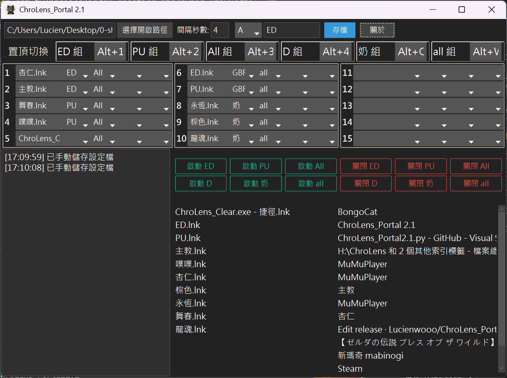

# ChroLens_Portal
## Future Plans
* Possibly add timed automatic program launch and group activation/deactivation.
---

[English](README_EN.md) | [日本語](README_JA.md)

---

[[ChroLens_Portal Basic Operations]](https://player.vimeo.com/video/1087659485?h=83487a7ea9)
### ChroLens_Portal Core Function: Turn Your Computer into a "Starter Pack" Launcher!

This program acts like a **computer launch assistant**, perfect for situations where you often need to open many things simultaneously.
Busy, and getting busier.

It can:

* **"One-Click Launch":** Group frequently used programs, documents, or shortcuts. With a single click, open them all in sequence, no need to click one by one.
* **"Close When Done":** Once a set of tasks is complete, easily close all related windows at once, keeping your desktop clean and tidy.
* **"Automatic Memory":** Your group names, file lists, and opening order are all remembered for the next time you open the program.

### "Group Launch": Tailor-Made "Scenario Modes" for Your Efficiency

The most thoughtful design of this program is its ability to let you **"package" various files and applications on your computer into distinct "scenario modes" based on different needs**. Whether it's documents, images, videos, music, or even various shortcuts (`.LNK` files), everything can be managed properly. Imagine it as a smart hotkey tailored for your digital life:

* **When working on a project**: Word + Reference PDFs + Browser.
* **When designing**: Photoshop + Illustrator + Material files.
* **When gaming**: Emulator/MapleStory Artale/LOL + Discord + Strategy guide website.

---
Planned Development:
1.  Custom System Scheduler: A simpler and more intuitive way to set up Windows Task Scheduler, possibly adding other personalized functions like timed opening/closing of certain programs.

---
# ChroLens Project 
## [ChroLens_Portal](https://github.com/Lucienwooo/ChroLens_Portal) - Batch open/close grouped files, hotkey switch multiple windows to always-on-top.  
## [ChroLens_Mimic](https://github.com/Lucienwooo/ChroLens_Mimic) - Macro recording tool, keyboard/mouse simulation, auto-clicker.  
## [ChroLens_Clear](https://github.com/Lucienwooo/ChroLens_Clear) - Automatically close multiple windows/programs.  
 

Planned Development:
1.  Custom System Scheduler: A simpler and more intuitive way to set up Windows Task Scheduler, possibly adding other personalized functions like timed opening/closing of certain programs.

---
#### 📄 Licensing  

The code in this project is released under the GNU General Public License v3.0 (GPLv3). This means you are free to use, study, modify, and distribute this code, but you must abide by all terms of the license.  
If you wish to use this code in a closed-source project, for commercial sale, or require specialized commercial support services, please contact us.  
For full details, please refer to the [LICENSE file](LICENSE) in the project root directory.

---

#### 📄 Disclaimer  

This code is provided for general informational purposes and use only. The author assumes no responsibility for any damages incurred from the use or inability to use this code. Use of this code is at your own risk.

---

### 💸 Support the Creator 💸
 
 **These scripts saved you time—share a bit and donate. Give me money!**   
 **これらのツールで浮いた時間、ちょっとだけ投げ銭して？お金ちょうだい！**     
 **これらのツールで浮いた時間、ちょっとだけ投げ銭して？お金ちょうだい！**   

👉 If you have any questions, ideas, or suggestions, please join my [Discord ChroLens](https://discord.gg/72Kbs4WPPn)