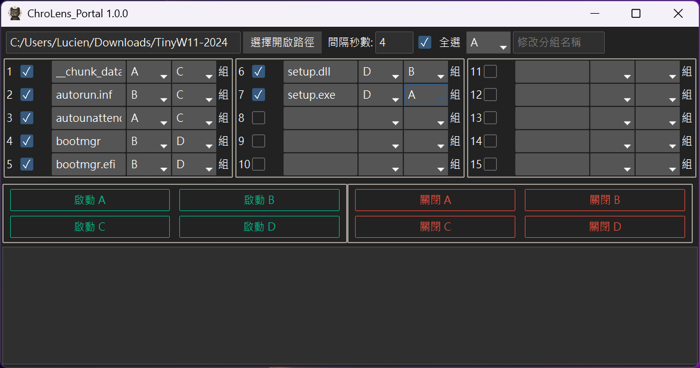

# ChroLens_Portal
## 今後の計画
* 時間指定による自動プログラム起動およびグループの起動/終了機能を追加する可能性があります。
---

[繁體中文](README.md) | [English](README_EN.md)

---

[[ChroLens_Portal_基本操作]](https://player.vimeo.com/video/1087659485?h=83487a7ea9)
### ChroLens_Portal コア機能：あなたのPCを「おまかせ起動」ランチャーに変える！

このプログラムは、あなたの**PC起動アシスタント**として機能し、特に多くのものを同時に開くことが多い現代の状況に最適です。

これにより、以下のことが可能になります：

* **「ワンクリック起動」：** よく使うプログラム、ファイル、またはショートカットをグループ化し、ワンクリックですべて順番に開くことができます。
* **「使い終わったら閉じる」：** 一連のタスクを終えた後、関連するウィンドウを一度に簡単に閉じることができ、デスクトップをきれいに保てます。
* **「自動記憶」：** グループ名、ファイルリスト、または起動順序に関わらず、次回プログラムを開いた際にすべてを記憶しています。

### 「グループ起動」：あなたの効率に合わせてカスタマイズされた「シナリオモード」

このプログラムの最もきめ細やかな設計は、コンピュータ上の様々なファイルやアプリケーションを、**異なるニーズに応じて「シナリオモード」として「パッケージ化」できる**ことです。ドキュメント、画像、ビデオ、音楽、さらには様々なショートカット（.LNKファイル）まで、すべてを適切に管理できます。これは、あなたのデジタルライフのためにカスタマイズされたインテリジェントなショートカットと想像してください：

* **プロジェクト**: Word + 参考資料PDF + ウェブブラウザ
* **デザイン**: Photoshop + Illustrator + 素材フォルダ
* **ゲーム**: Valorant/FF14 + Discord + 攻略サイト

---

### 📄 ライセンス情報 (Licensing)

このプロジェクトのコードは、**GNU General Public License v3.0 (GPLv3)** に基づいて公開されています。これは、このコードを自由に使用、学習、修正、および配布できることを意味しますが、このライセンスのすべての条件に従う必要があります。

**もし、このコードをクローズドソースプロジェクト、商業目的での再配布、または専用の商用サポートサービスを必要とする場合、別途商用ライセンスの購入についてお問い合わせください。**

詳細については、プロジェクトのルートディレクトリにある [LICENSE ファイル](LICENSE) をご参照ください。

---

### 📄  免責事項
このコードは一般的な参考および用途のみを目的として提供されています。著者は、このコードの使用または使用不能に起因するいかなる損害についても責任を負いません。このコードの使用に伴うリスクは、ユーザー自身が負うものとします。

---

### 💸 作者を応援する / Support the Creator

🧠 **これらのプログラムが節約してくれた時間、少しだけ投げ銭して？お金ちょうだい！**
⌛ **これらのプログラムが節約してくれた時間、少しだけ投げ銭して？お金ちょうだい！**
🪙 **このツールで浮いた時間、ちょっとだけ投げ銭して？お金ちょうだい！**

👉

👉もちろん、ご質問、ご意見、ご提案がありましたら、ぜひ私の [Discord－ChroLens_](https://discord.gg/72Kbs4WPPn) にご参加ください。